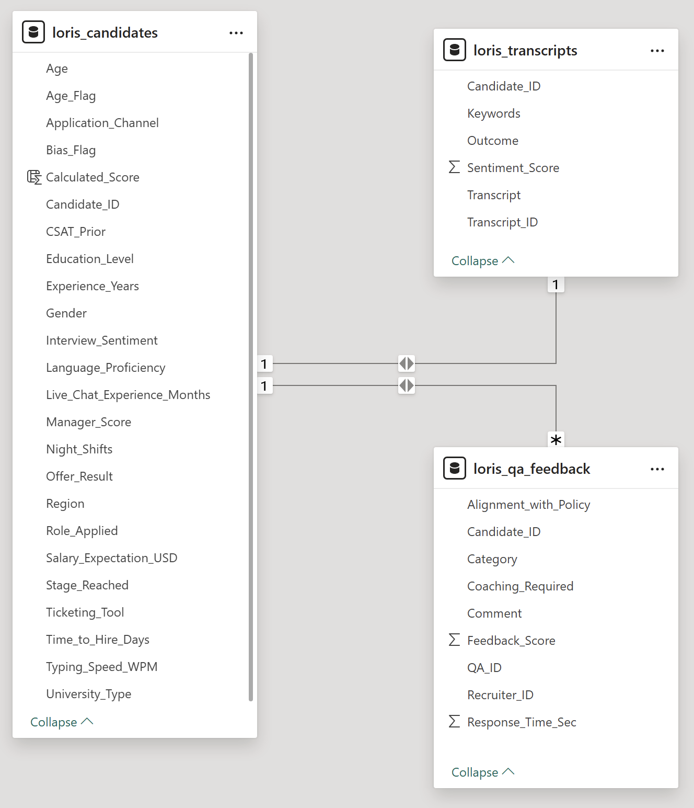
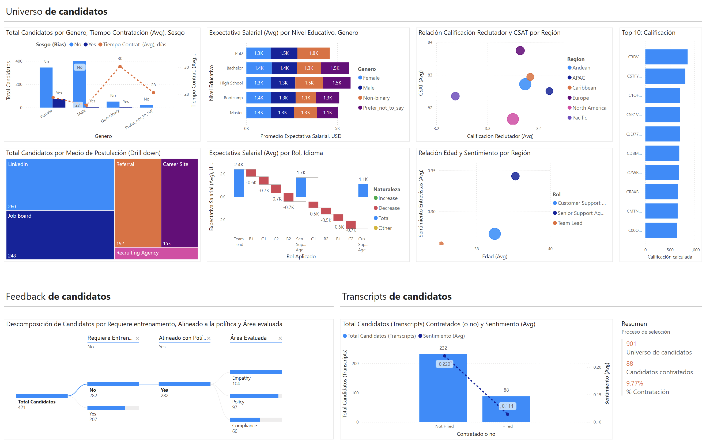
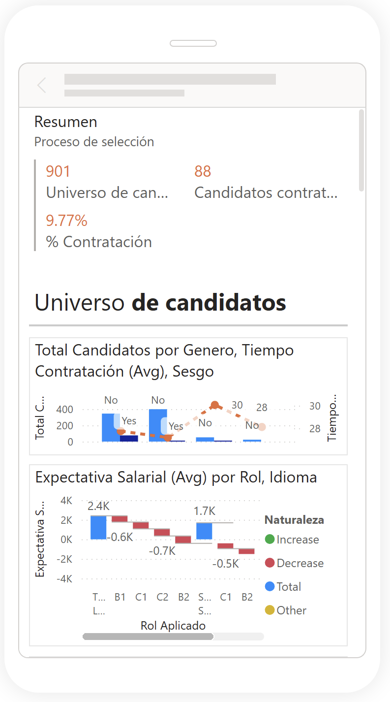
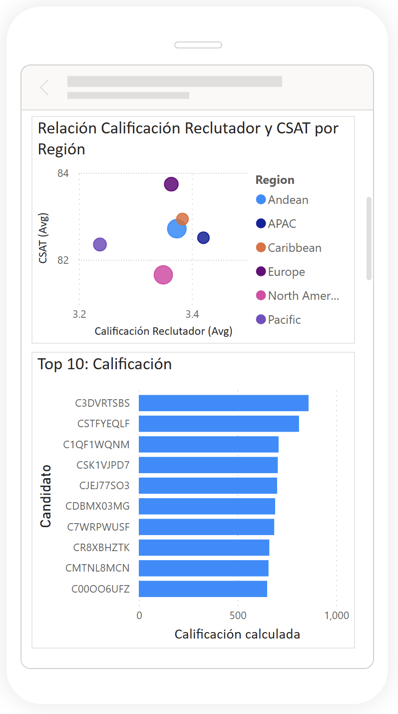
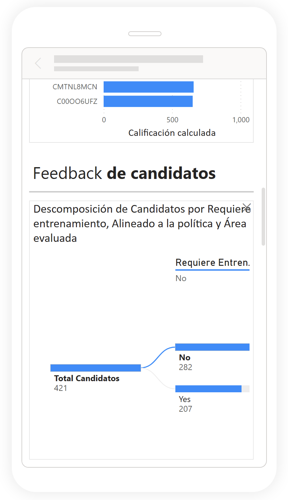
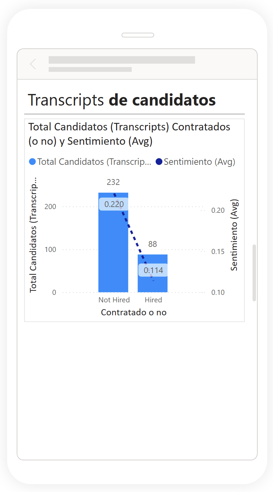

# Proyecto final: Caso Loris
_14 sep, 2025_

## Descripción
Dashboard para consultar perfil de candidatos, análisis de entrevistas cortas (subconjunto) y retroalimentación de los reclutadores, como parte del proceso de contratación.


## Componente desarrollado
### Fuente de datos
1. **loris_candidates.csv**: Conjunto de datos principal (1000 candidatos simulados)
2. **loris_qa_feedback.csv**: Registros de retroalimentación de reclutadores (550 registros)
3. **loris_transcripts.csv**: Subconjunto de entrevistas (320 registros)

### Modelo Relacional de Datos (MRD)


#### Relaciones
|Llave primaria (PK)|Llave foranea (FK)| Cardinalidad|
|-------------------|------------------|-------------|
|loris_candidates (Candidate_ID)|loris_transcripts (Candidate_ID)|1...1|
|loris_candidates (Candidate_ID)|loris_qa_feedback (Candidate_ID)|1...*|

### Exploración de datos
#### Premisas:
1. Candidatos con experiencia laboral a partir de los 18 años

#### Reglas de negocio
1. Excluir aquellos candidatos en donde su experiencia laboral ha iniciado por debajo de los 18 años.

```Python
# Step 1: Create custom column (Power Query)
Table: loris_candidates
Column name: Age_Flag
Formula: if ([Age]-18) < [Experience_Years] then "NA" else "Apply")

# Step 2: Filtered rows (Power Query)
Filter condition: [Age_Flag] = "Apply"
```

2. Calcular metodo de calificación que contemple la calificación del reclutador, satisfacción de clientes en empleos previos y sentimiento global de entrevistas.

```Python
#Step: Create custom column (Model View)
Table: loris_candidates
Column name: Calculated_Score
Formula: loris_candidates[Manager_Score] * loris_candidates[Interview_Sentiment] * loris_candidates[CSAT_Prior]
```

#### Medidas

```Python
# Measure 1: All candidates
Universo_Candidatos = DISTINCTCOUNT(loris_candidates[Candidate_ID])

# Measure 2: Hired candidates
Candidatos_Contratados = 
    CALCULATE(
        COUNT(loris_transcripts[Candidate_ID]),
        FILTER(
            loris_transcripts,
            loris_transcripts[Outcome] = "Hired"
        )
    )

# Measure 3: Percentage of employees
% Contratación = [Candidatos_Contratados] / [Universo_Candidatos]
```


### Visualización
#### Vista de escritorio:


>**Graficas: Universo de candidatos**
<br>1. [Donut chart] Total de candidatos agrupados por Genero
<br>2. [Treemap] Total de candidatos por Medio de postulación y Rol aplicado
<br>3. [Stacked bar chart] Promedio de Expectativa salarial (USD) por Nivel educativo y Genero
<br>4. [Stacked bar chart] Promedio de Expectativa salarial (USD) por Rol aplicado y Nivel idioma
<br>5. [Scatterc chart] Relación promedio Calificación reclutados y CSAT agrupado por Región
<br>6. [Scatterc chart] Relación promedio Edad y Sentimiento entrevistas agrupado por Rol aplicado
<br>7. [Stacked bar chart] Top 10 Candidatos por Calificación personalizada (Nuevo calculo)

>**Grafica: Feedback de candidatos**
<br>[Decomposition tree] Descomposición de Candidatos por Requiere entrenamiento, Alineado a la política y Área evaluada

>**Graficas: Transcipts de candidatos**
<br>1. [Line and clustered column chart] Total de candidatos contratados o no con promedio de sentimiento
<br>2. [Multi-row card] Universo de candidatos, Candidatos contratados, % Contratación

#### Vista móvil:





>**Graficos:**
<br>1. [Multi-row card] Universo de candidatos, Candidatos contratados, % Contratación
<br>2. [Donut chart] Total de candidatos agrupados por Genero
<br>3. [Stacked bar chart] Promedio de Expectativa salarial (USD) por Rol aplicado y Nivel idioma
<br>4. [Scatterc chart] Relación promedio Calificación reclutados y CSAT agrupado por Región
<br>5. [Stacked bar chart] Top 10 Candidatos por Calificación personalizada (Nuevo calculo)
<br>[Decomposition tree] Descomposición de Candidatos por Requiere entrenamiento, Alineado a la política y Área evaluada
<br>6. [Line and clustered column chart] Total de candidatos contratados o no con promedio de sentimiento

#### Acceso:
##### Url:
https://app.powerbi.com/view?r=eyJrIjoiZjA4ODllYzQtMjE1Zi00OTYxLWI2YTgtMGZkYjJkMjA3ZjliIiwidCI6ImU5OTQwNzJiLTUyM2UtNGJmZS04NmUyLTQ0MmM1ZTEwYjI0NCIsImMiOjR9

##### Dispositivo móvil:
Debe contar con la app de Power BI instalada en su dispositivo al igual que el respectivo permiso para ver este reporte:


## Autores
**Grupo 3: Analítica para los negocios**
<br>Jennifer Pahola Lopez Castellanos
<br>Paula Andrea Suarez Ruiz
<br>Karina Burbano Zacanamboy
<br>Jaime Andres Rodriguez Moreno
<br>Ricardo Alexis Ramirez Pineda
<br>Frank Edwin Ceron Gonzalez
<br>Manolo Constain Villa
<br>Guillermo Alexis Jiménez

## Histórico de versiones
[1.0] Versión inicial
